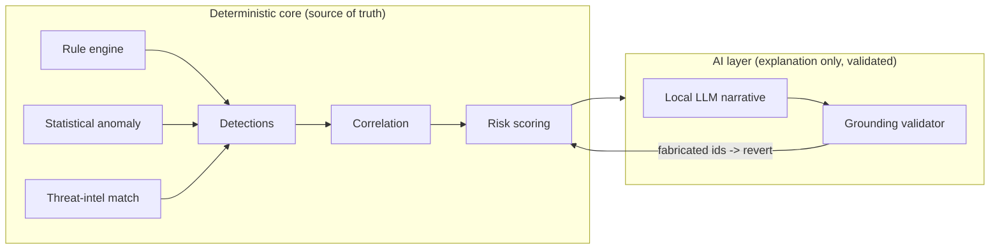
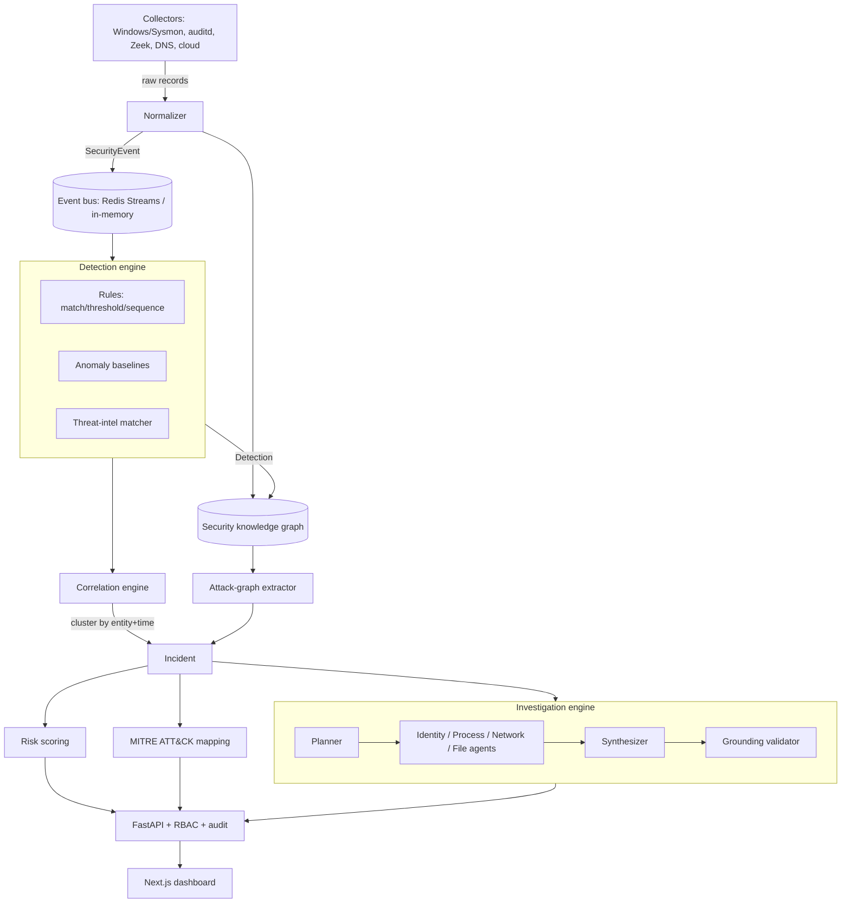
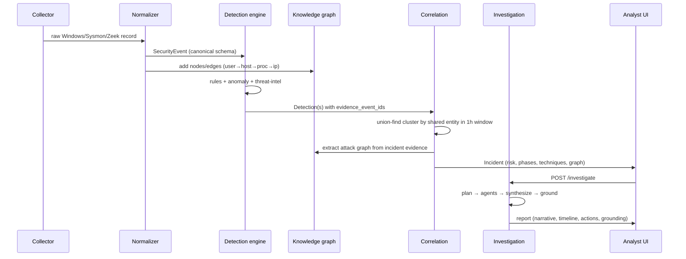

# Aegis — Architecture

Aegis is a self-hosted platform that ingests security telemetry, detects malicious behaviour with
deterministic engines, correlates isolated detections into incidents, reconstructs the attack as a
graph, maps it to MITRE ATT&CK, scores risk, and produces an evidence-grounded investigation report.
It runs with **zero paid API dependency**: threat intelligence comes from public feeds cached locally,
and the optional narrative LLM is a local Ollama model.

## Design principle: AI is not the detector

The single most important architectural decision. Detection is **deterministic and statistical** — YAML
rules, robust z-scores, first-seen baselines, threat-intel matching. The LLM is used *only* for language
tasks (planning which agents to run, writing the incident narrative, answering analyst questions), and
even then its output is validated against the real evidence set before it is trusted
(`backend/aegis/investigation/grounding.py`). The platform produces a complete, correct report **with the
LLM switched off** — the model enriches prose, it never decides whether something is malicious.

## Component view

## Data flow (one attack)

## The canonical event schema

Every collector is mapped by `backend/aegis/ingestion/normalizer.py` onto one Pydantic model,
`SecurityEvent` (`backend/aegis/schemas/events.py:74`). Downstream code never sees a vendor format.
Twenty event types are supported (`EventType`, `events.py:30`): `authentication`, `process_start`,
`process_end`, `file_create/modify/delete/read`, `network_connection`, `dns_query`, `privilege_change`,
`user_created/deleted`, `group_change`, `service_started/stopped`, `scheduled_task`, `registry_change`,
`security_alert`, `application_log`, `system_log`. Source types (`SourceType`, `events.py:18`) include
`windows`, `linux`, `network`, `dns`, `cloud`, `application`, `edr`, `identity`, `simulator`.

`SecurityEvent` treats **all string fields as untrusted** (`str_max_length=8192`, `extra="forbid"`) and
carries `raw` for forensic fidelity. It exposes `entity_keys()` (used by correlation), `fingerprint()`
(dedup), and `short()` (compact rendering for reports/prompts).

## Streaming / bus abstraction

`backend/aegis/ingestion/bus.py` defines an `EventBus` protocol with two implementations:

- **`RedisStreamBus`** — production. Producers `XADD` JSON-encoded events; a detection worker consumes
  through a consumer group (`aegis-detectors`) for at-least-once delivery and horizontal scale. Poison
  messages are acked and dropped so a malformed record can never wedge the stream.
- **`InMemoryBus`** — dev/test/eval. Same interface, a `queue.Queue` behind it.

`make_bus(redis_url, stream, group)` returns the right one based on config (`redis_url=None` ⇒ in-memory).

## One pipeline, three entrypoints

`backend/aegis/pipeline.py` (`Platform`) is the single synchronous, side-effect-bounded core that owns
every engine. The same object serves:

- **The API** (`backend/aegis/api/state.py` holds one `Platform` singleton),
- **The stream worker** (consumes the bus, calls `Platform.ingest`),
- **The evaluation harness** (`simulator/aegis_sim/evaluation.py` drives `Platform` directly).

This is why the benchmark numbers reflect the exact code path the product runs — there is no separate
"eval implementation" to drift.

## Tenancy

Every `SecurityEvent`, `Detection` and `Incident` carries a `tenant_id`. Ingestion stamps the configured
tenant; reads are scoped to the caller's tenant claim (JWT `tenant`). Entity keys and correlation are
tenant-local by construction because events are only ever correlated within one `Platform`/tenant scope.

## Risk scoring, in one line

`risk = noisyOR(confidence-weighted detection scores) + kill-chain-diversity bonus + threat-intel bonus
+ asset-criticality bonus + breadth bonus`, capped at 100, with every term returned in `score_breakdown`
so the UI can show *why* it is a 91 (`backend/aegis/scoring/risk.py`). See `DETECTION.md`.

## Tech stack

| Layer | Technology |
|-------|------------|
| Language | Python 3.11+ (typed, Pydantic v2) |
| API | FastAPI, Uvicorn, python-jose (JWT), passlib (pbkdf2_sha256) |
| Detection | Custom YAML rule DSL, NumPy (robust statistics) |
| Graph | NetworkX (`MultiDiGraph` knowledge graph + attack-graph extraction) |
| Threat intel | Public feeds (abuse.ch Feodo/URLhaus/ThreatFox, Spamhaus DROP) cached locally |
| Streaming | Redis Streams (prod) / in-memory (dev) |
| AI | Ollama local LLM (optional), evidence-grounding validator |
| Persistence | SQLite (dev) / PostgreSQL + pgvector (optional) |
| Observability | Prometheus metrics, hash-chained audit log |
| Frontend | Next.js (App Router), TypeScript, Tailwind, React Flow, Recharts |
| Packaging | Docker Compose, GitHub Actions CI |

See `DETECTION.md` (engine reference), `THREAT_MODEL.md` (securing Aegis itself), `EVALUATION.md`
(methodology + results), `API.md` (endpoints), and `RUNBOOK.md` (operations).
